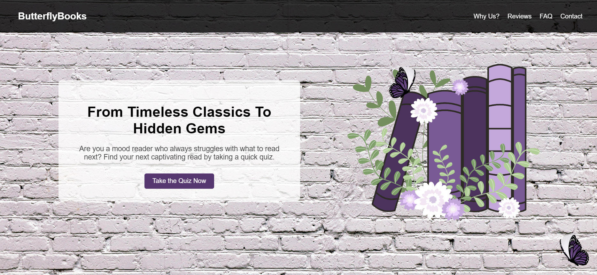
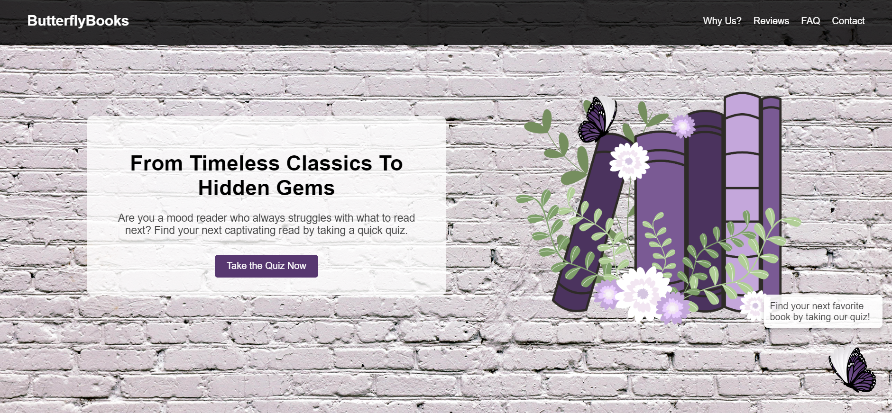
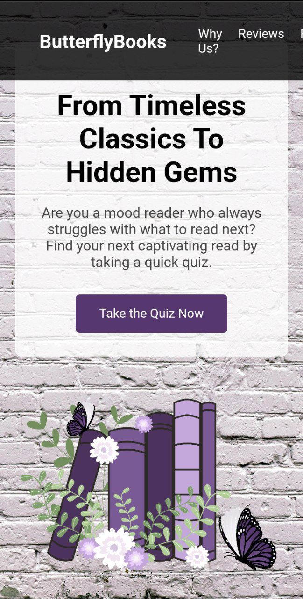

# Book Recommendation Landing Page  

This landing page helps users discover new books through an interactive quiz. It features a responsive design, a mascot with a hover-activated speech bubble, and a clear call to action.  

---

## Features  

### Responsive Design  
- Fully optimized for desktop, tablet, and mobile viewing  
- Elements adjust dynamically for different screen sizes  

### Mascot with Hover-Activated Speech Bubble  
- A mascot appears on the page to guide users  
- When hovered, a speech bubble displays the message:  
  "Find your next favorite book by taking our quiz!"  
- The bubble stays within screen boundaries for readability  

### Modern and Engaging UI  
- Clean and minimalistic design with soft shadows and rounded edges  
- A book-themed background for a cohesive aesthetic  
- High-contrast buttons and text for readability  

### Call to Action Always Visible  
- The "Take the Quiz" button remains accessible on both desktop and mobile  
- Encourages users to interact and get book recommendations   

---

## Live Demo  

The landing page is deployed and accessible online.  

[View the Book Recommendation Page](https://ernu-catalina.github.io/PWeB-Labs/)  

---

## Screenshots  

### Hero Section (Desktop View)  
 

### Mascot & Speech Bubble (Hover Effect)  
 

### Mobile View  
  

---

## Technologies Used  

- HTML5 for page structure  
- CSS3 for styling, layout, animations, and responsiveness  
- GIF/SVG mascot for interactivity   

---

## Deployment Details  

This project is hosted using GitHub Pages.